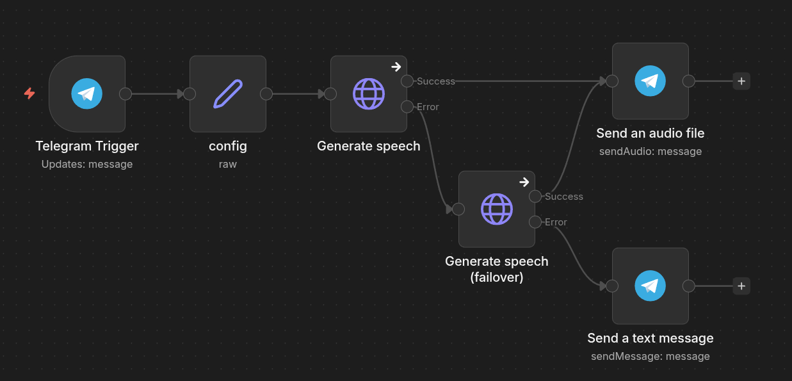

### n8n flow example




```
{
  "name": "TG TTS bot (docker)",
  "nodes": [
    {
      "parameters": {
        "updates": [
          "message"
        ],
        "additionalFields": {}
      },
      "type": "n8n-nodes-base.telegramTrigger",
      "typeVersion": 1.2,
      "id": "...",
      "name": "...",
      "webhookId": "...",
      "credentials": {
        "telegramApi": {
          "id": "...",
          "name": "..."
        }
      }
    },
    {
      "parameters": {
        "operation": "sendAudio",
        "chatId": "...",
        "binaryData": true,
        "additionalFields": {}
      },
      "type": "n8n-nodes-base.telegram",
      "typeVersion": 1.2,
      "id": "...",
      "name": "...",
      "webhookId": "...",
      "credentials": {
        "telegramApi": {
          "id": "...",
          "name": "..."
        }
      }
    },
    {
      "parameters": {
        "method": "POST",
        "url": "={{ $('config').item.json.TTS_API[0] }}/generate",
        "sendBody": true,
        "specifyBody": "json",
        "jsonBody": "={{\n{\n  \"text\": $node[\"Telegram Trigger\"].json.message.text,\n  ...$json.speech\n}\n}}",
        "options": {
          "response": {
            "response": {
              "responseFormat": "file"
            }
          }
        }
      },
      "type": "n8n-nodes-base.httpRequest",
      "typeVersion": 4.3,
      "id": "...",
      "name": "...",
      "onError": "continueErrorOutput"
    },
    {
      "parameters": {
        "mode": "raw",
        // .....
        "options": {}
      },
      "type": "n8n-nodes-base.set",
      "typeVersion": 3.4,
      "id": "...",
      "name": "..."
    },
    {
      "parameters": {
        "chatId": "...",
        "text": "Something went wrong :(",
        "additionalFields": {
          "appendAttribution": false
        }
      },
      "type": "n8n-nodes-base.telegram",
      "typeVersion": 1.2,
      "id": "...",
      "name": "...",
      "webhookId": "...",
      "credentials": {
        "telegramApi": {
          "id": "...",
          "name": "..."
        }
      }
    },
    {
      "parameters": {
        "method": "POST",
        "url": "={{ $('config').item.json.TTS_API[1] }}/generate",
        "sendBody": true,
        "specifyBody": "json",
        "jsonBody": "={{\n{\n  \"text\": $node[\"Telegram Trigger\"].json.message.text,\n  ...$json.speech\n}\n}}",
        "options": {
          "response": {
            "response": {
              "responseFormat": "file"
            }
          }
        }
      },
      "type": "n8n-nodes-base.httpRequest",
      "typeVersion": 4.3,
      "id": "...",
      "name": "...",
      "onError": "continueErrorOutput"
    }
  ],
  "pinData": {},
  "connections": {
    "Telegram Trigger": {
      "main": [
        [
          {
            "node": "config",
            "type": "main",
            "index": 0
          }
        ]
      ]
    },
    "Generate speech": {
      "main": [
        [
          {
            "node": "Send an audio file",
            "type": "main",
            "index": 0
          }
        ],
        [
          {
            "node": "Generate speech (failover)",
            "type": "main",
            "index": 0
          }
        ]
      ]
    },
    "config": {
      "main": [
        [
          {
            "node": "Generate speech",
            "type": "main",
            "index": 0
          }
        ]
      ]
    },
    "Generate speech (failover)": {
      "main": [
        [
          {
            "node": "Send an audio file",
            "type": "main",
            "index": 0
          }
        ],
        [
          {
            "node": "Send a text message",
            "type": "main",
            "index": 0
          }
        ]
      ]
    }
  },
  "active": true,
  "settings": {
    "executionOrder": "v1",
    "timeSavedMode": "fixed",
    "timezone": "...",
    "callerPolicy": "workflowsFromSameOwner",
    "availableInMCP": false
  },
  "versionId": "...",
  "meta": {
    "templateCredsSetupCompleted": true,
    "instanceId": "..."
  },
  "id": "...",
  "tags": []
}
```


## Run

`docker compose up -d --build`

## Request example

```
curl --location 'http://<host>:4123/generate' \
--header 'Content-Type: application/json' \
--data '{
    "text": "Bonjour...",
    "voice": "french-mornings.wav",
    "language_id": "fr"
}'
```